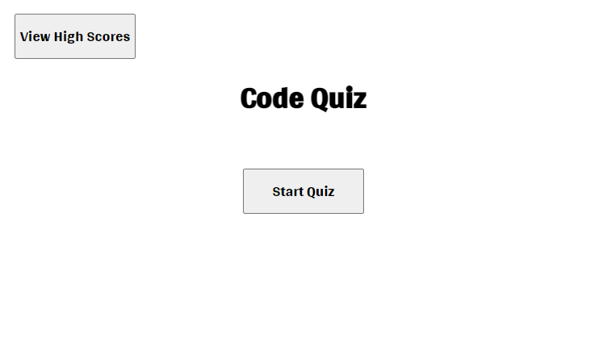
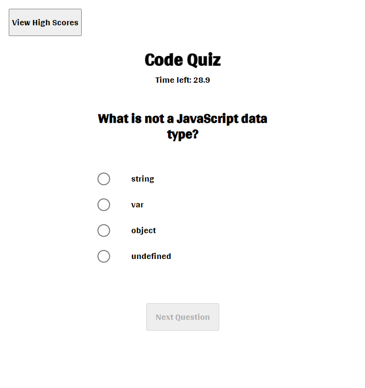
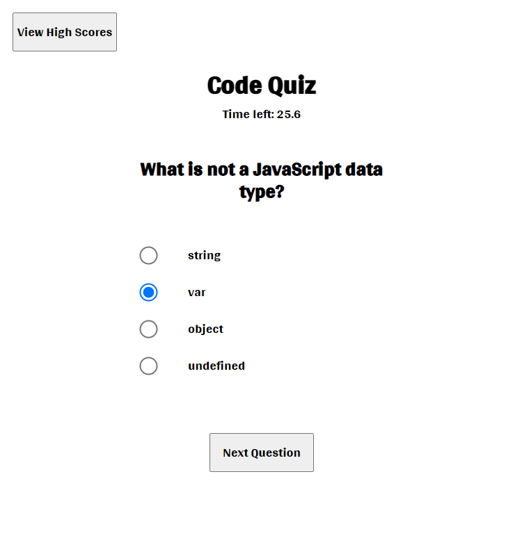
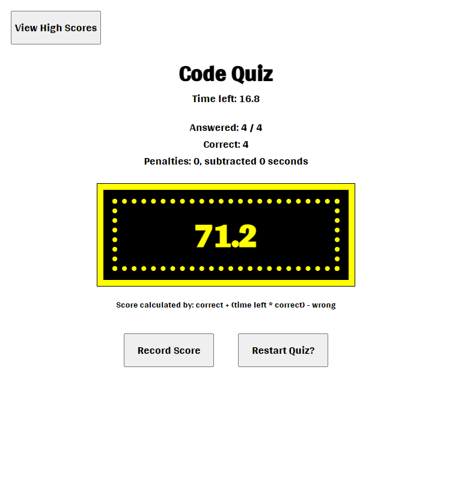
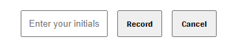

# Code Quiz

This application is a short code quiz on JavaScript.

When the application loads, there are 2 buttons to choose from, 'Start Quiz' & 'View High Scores'.

When the user clicks the 'Start Quiz' button, a question and list of choices are presented to the user.

By default, the 'Next Question' button is disabled. When a choice for a question is selected, the 'Next Question' button is enabled.

When time runs out or all questions have been answered, the user is presented with their score.

This quiz scoring is defined as: correct + (time left \* correct) - wrong.

When the quiz is completed the user has the option to record their score, by clicking the 'Record Score' button then entering their initials.

Clicking the 'View High Scores' button will display up to the number stored in the variable 'highScoreDisplayLimit'. The application has 'highScoreDisplayLimit' set to 10.

## Satisfied Acceptance Criteria

```
GIVEN I am taking a code quiz

WHEN I click the start button
THEN a timer starts and I am presented with a question

WHEN I answer a question
THEN I am presented with another question

WHEN I answer a question incorrectly
THEN time is subtracted from the clock

WHEN all questions are answered or the timer reaches 0
THEN the game is over

WHEN the game is over
THEN I can save my initials and my score
```

## Screenshots

### Code Quiz Initial Screen

Simple screen with buttons to 'Start Quiz' or 'View High Scores'.<br />


### Code Quiz Started

Timer starts and questions are presented. The 'Next Question' button is disabled until an answer has been selected.<br />


### Code Quiz Question Answered

The 'Next Question' button is enabled after an answer has been selected. If the 'Next Question' button is clicked and the selected answer is incorrect, time is subtracted from the timer. This application has a variable 'penaltyTime' set to 5.0 (seconds) used to subtract for each wrong answer.<br />


### Code Quiz Complete

When quiz is complete, the score is presented with explanation on how scoring is tallied. Buttons to 'Record Score' & 'Restart Quiz?' are presented.<br />


### Code Quiz Record Score Form

The record score form has 1 input for adding 1-3 initials. Adding initials and clicking the 'Record' button adds the score to the local storage value array for the key 'highScores'.<br />


### Code Quiz High Scores

High scores are sorted in descending order. The variable 'highScoreDisplayLimit' is set to 10 allowing up to 10 high scores to be displayed.<br />


## Application Location

[https://bravotango.github.io/Code-Quiz/](https://bravotango.github.io/Code-Quiz/)
