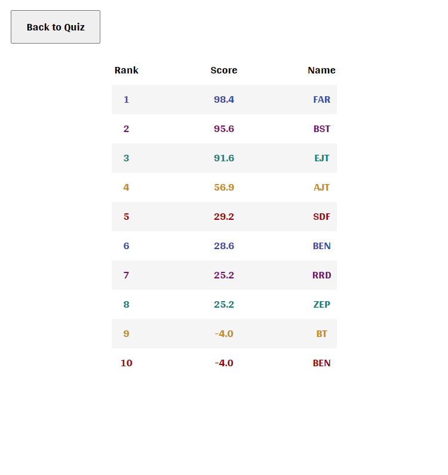

# Code Quiz

This application presents questions and list of choices to the user when the user clicks the 'Start Quiz' button. When a choice for a question is selected, the next question button is enabled. When time runs out or all questions have been answered. The user is presented with there score. This quiz scoring is defined as: correct + (time left \* correct) - wrong. When the quiz is completed the user has the option to record their score, by clicking the 'Record Score' button then entering their initials. There is 'View High Scores' button, that the user can click to view the top 10 scores.

## Satisfied Acceptance Criteria

```
GIVEN I am taking a code quiz

WHEN I click the start button
THEN a timer starts and I am presented with a question

WHEN I answer a question
THEN I am presented with another question

WHEN I answer a question incorrectly
THEN time is subtracted from the clock

WHEN all questions are answered or the timer reaches 0
THEN the game is over

WHEN the game is over
THEN I can save my initials and my score
```

## Screenshots

### Quiz Initial Screen

Simple screen with buttons to start quiz or view high scores.


### Quiz Started

Timer starts and questions are presented. Next question button is disabled until an answer has been selected.


### Quiz Question Answered

Next button is enabled after answer has been selected.


### Quiz Complete

When quiz is complete, score is presented with explanation on how scoring is tallied. Buttons to record score & restart quiz are presented.


### Quiz Record Score Form

Record score from has 1 input for adding 1-3 initials. Adding initials and clicking record adds the score to the local storage key 'highScores'.


### Quiz High Scores

High scores are sorted in descending order. The variable 'highScoreDisplayLimit' is set to 10 allowing up to 10 high scores to be displayed.


## Application Location

[https://bravotango.github.io/code-quiz/](https://bravotango.github.io/code-quiz/)
